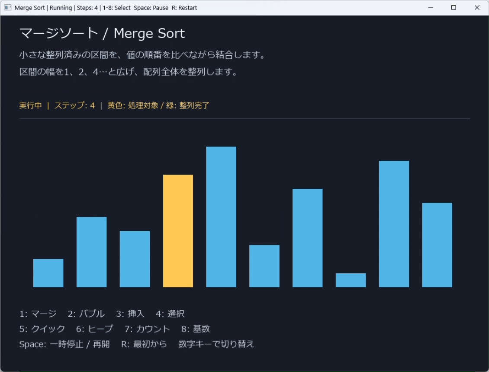
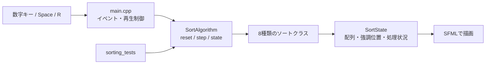

# Algorithm Visualizer — C++ / SFML

8種類のソートを、**同じ入力・同じ画面で1ステップずつ観察する**Windows向けデスクトップアプリです。
比較・交換・書き戻しの途中経過を棒グラフで表示し、日本語でアルゴリズムの仕組みと処理状況を説明します。

**C++17 · SFML 3.1.0 · CMake · Windows x64**

[Windows版をダウンロード](https://github.com/nasuton/algorithm-visualizer/releases/download/v0.1.0/algorithm-visualizer-v0.1.0-windows-x64.zip) · [リリース一覧](https://github.com/nasuton/algorithm-visualizer/releases) · [ソースコード](https://github.com/nasuton/algorithm-visualizer)

## 動作デモ



## この作品で取り組んだこと

- ソート処理を独立したクラスに分け、SFMLの描画処理から切り離す。
- 一括処理ではなく `step()` で進め、再生中も切り替え・一時停止・再実行できるようにする。
- クイックソートの基準値、ヒープの構築・修復、カウントの集計、基数ソートの桁とバケットを表示する。
- 正解データとの比較に加え、途中リセットや境界値も自動テストする。

## すぐに試す

1. [v0.1.0のWindows版ZIP](https://github.com/nasuton/algorithm-visualizer/releases/download/v0.1.0/algorithm-visualizer-v0.1.0-windows-x64.zip) をダウンロードし、フォルダー全体を展開します。
2. `algorithm_visualization.exe` を起動します。
3. ウィンドウを選択し、数字キーでアルゴリズムを切り替えます。Enterは不要です。

必要な環境はWindows x64、日本語フォント、OpenGLを利用できるグラフィックス環境です。
動作確認はWindows 11 x64の開発PCで行っており、別PCでのGUI動作は未確認です。
MSVCランタイムがない場合は、[Microsoft公式のVisual C++再頒布可能パッケージ（x64）](https://learn.microsoft.com/en-us/cpp/windows/latest-supported-vc-redist)をインストールしてください。
CMakeやVisual Studioは、配布済みの実行ファイルを使うだけなら不要です。

日本語フォントは `assets/font.ttf`、`C:/Windows/Fonts/meiryo.ttc`、`C:/Windows/Fonts/YuGothM.ttc` の順に探します。
フォントはZIPに同梱していません。別の日本語フォントを使う場合は起動引数で指定できます。

```powershell
.\algorithm_visualization.exe "C:/Windows/Fonts/meiryo.ttc"
```

## 操作

| キー（テンキーも対応） | アルゴリズム | 観察できる動き |
| --- | --- | --- |
| `1` | マージソート | 整列済みの区間を結合して書き戻す |
| `2` | バブルソート | 隣接する2要素を比較・交換する |
| `3` | 挿入ソート | 次の値を整列済みの部分へ挿入する |
| `4` | 選択ソート | 最小値を探し、左側へ確定する |
| `5` | クイックソート | ピボットで区間を分割する |
| `6` | ヒープソート | 最大ヒープを構築・修復し、最大値を取り出す |
| `7` | カウントソート | 出現回数を数え、小さい値から書き戻す |
| `8` | 基数ソート | 下位桁からバケットへ分類・回収する |
| `Space` | 一時停止 / 再開 | |
| `R` | 現在のソートを最初から再生 | |

通常の棒は青、処理対象は黄色、整列完了後は緑です。
起動時はマージソートを再生し、番号を押すと同じ初期配列から再開します。
画面上部に名称・説明・処理状況・ステップ数、下部にキー操作を表示します。

## 設計



アルゴリズムはSFMLに依存せず、状態を `SortState` として公開します。
描画側が0.25秒ごとに `step()` を呼び、更新された配列を表示します。
クイックソートでは未処理区間をスタックに保存し、マージソートではボトムアップ方式を使うことで、途中で処理を止められるようにしています。
基数ソートは最小値からの差を符号なし整数のキーに変換し、負数を含む入力も扱います。

## ビルド

CMake 3.28以上、Git、Visual Studio 2022の「C++によるデスクトップ開発」（MSVC・Windows SDK）が必要です。
初回はインターネットからSFMLと依存ライブラリを取得します。

```powershell
cmake -S . -B build -G "Visual Studio 17 2022" -A x64
cmake --build build --config Release --parallel
ctest --test-dir build -C Release --output-on-failure
.\build\bin\Release\algorithm_visualization.exe
```

## 検証

Release版で **8,097ケースの整列結果、31ケースの範囲超過の拒否**を確認しました。
さらに、再生途中の各ステップからのリセット、1ステップ更新、完了後の呼び出しも検証しています。

- 空配列、1要素、整列済み、逆順、重複、負数
- 整数の最大・最小値、桁数の異なる値、固定シードの乱数
- 2〜6要素の全順列
- カウントソートの範囲制限の境界値

期待結果には `std::stable_sort` を使用しています。整数値の比較であり、同値要素の安定性を独立に検証するテストではありません。

## 現在の仕様と制限

- 画面の配列は固定の10要素（1〜10）。配列入力UIと速度調整UIはありません。
- 切り替えると再生は最初から始まります。ヒープは棒グラフで表現し、木そのものは描画しません。
- 各アルゴリズムの1ステップの意味は異なり、ステップ数や再生時間は速度のベンチマークではありません。
- カウントソートは `最大値 - 最小値 + 1 <= 1,000,000` が条件です。
- マージ・カウント・基数ソートの書き戻し途中は、一時的に同じ値が複数表示されます。
- Windows以外のソースビルド・動作は未検証です。

## ファイル構成

```text
src/                     ソートクラス・SFMLの画面
tests/sorting_tests.cpp   正しさ・境界値・状態更新のテスト
CMakeLists.txt           依存取得・ビルド・CTest
docs/DEVELOPMENT.md      各アルゴリズムの詳細、計算量、開発手順
scripts/package-release.ps1  配布ZIPとSHA-256の生成
RELEASE_NOTES.md          v0.1.0の機能と制限
THIRD_PARTY_NOTICES.md    利用ライブラリの表記
licenses/                第三者ライセンス原文
```

アルゴリズムの詳しい説明とトラブルシューティングは[開発ガイド](docs/DEVELOPMENT.md)を参照してください。
リリース作成手順は[配布手順](docs/RELEASING.md)、変更内容は[リリースノート](RELEASE_NOTES.md)に記載しています。

## 第三者ライブラリ

SFMLと、その描画・文字処理に必要な依存ライブラリを使用しています。
FreeTypeの成果を一部利用しています（The FreeType Project: https://freetype.org）。
ライセンス・著作権表記は[THIRD_PARTY_NOTICES.md](THIRD_PARTY_NOTICES.md)と[licenses/](licenses/)を参照してください。
この第三者ライセンス表記は本プロジェクト独自コードの利用許諾を定めるものではありません。

